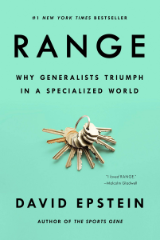

He de reconocer que este libro lo escogí con mucho *self-serving bias*. Con menos saltos que el autor, yo también:

> began worrying that I was a job-commitment-phobic drifter who must be doing this whole career thing wrong.

**"Range" es un alegato en contra de la (hiper) especialización**, especialmente en los *wicked learning environments* (donde las reglas no están claras o son incompletas, el feedback no es inmediato o no existe, no hay necesariamente patrones), frente a los *kind learning environments* (p. ej., el ajedrez, el golf...). Es fácil cuál de los dos entornos es el que más nos rodea en casi cualquier profesión (al menos, del conocimiento).

## Contra la especialización

En los *wicked learning environments*, el autor carga contra la mítica [regla de las 10.000 horas de Malcom Gladwell](https://en.wikipedia.org/wiki/Outliers_(book)) aglutinando distintas investigaciones, que reflejan cómo expertos en un dominio pagan su *expertise* con flexibilidad (*cognitive entrenchment*): estos **expertos no son capaces de transferir correctamente su experiencia a dominios ligeramente diferentes de su especialidad.**

Por desgracia, está muy enraizado en la sociedad que para dominar algo es necesario practicarlo muchas veces. Una queja típica de mis alumnos en MIOTI es que esperan cubrir menos áreas y poder repetir "10 veces los ejercicios para poder asentar conocimiento". Sin embargo, nunca en este ámbito profesional van a repetir tarea, con mucha probabilidad. Su profesión va a pasar a ser enfrentarse a cosas que no saben hacer todos los días. Así que este año arranqué con una frase del libro: 

> Research on thousands of adults in six industrializaing nations found that exposure to modern work with self-directed problem solving and nonrepetitive challenges was correlated with being "cognitively flexible".

Según el ***inside view,*** acuñado por Kahneman y Tversky, **cuanto más nivel de detalle se conoce de algo, más extremo se hace el juicio sobre ese algo.** También curioso en este sentido es Dan Kahan, profesor de psicología en Yale, que afirma que los adultos versados en ciencia son más proclives al dogmatismo y a polarizarse en torno a temas políticos, porque encuentran con más facilidad argumentos que apoyan sus sentimientos (sesgos de confirmación). 

Me sorprende mucho lo que explica **Shubin Dai, top data scientist en Kaggle:**

> To be frank, **I don't think we can benefit from domain expertise too much...** It's very hard to win a competition just by using well known methods. We need more creative solutions.

O, Pedro Domingos, profe de ciencias de la computación:  

> The people who win a Kaggle health competition have no training, no biology training, and they're also often not real machine learning experts.

Por otro lado: especializarse también es una estrategia un tanto arriesgada para el desarrollo profesional de un individuo:
> As information become more broadly available, the need for somebody to just advance a field isn't as critical because in effect they are available to everybody.

## Pro generalización

¿**Qué pinta tiene un aprendizaje orientado a la transferencia** de conocimientos a dominios no vistos? Consiste en enfrentarse a problemas de **establecer conexiones y generalizaciones estructurales en distintos dominios**. Por desgracia, parece que esto hace que el aprendizaje parezca más lento y sea más frustrante: todo lo contrario de lo que hacemos en el sistema educativo hoy.  Por otro lado, contra-intuitivamente, compensa mezclar temas en lugar de estudiar materias por bloques, no ya tanto por el *spaced-repetition,* si no por facilitar estas generalizaciones.  Además: 

> Struggling to retrieve information primes the brain for subsequent learning, even when retrieval itself is unsuccessful.

Al respecto de esas generalizaciones estructurales, me gustan mucho estas palabras de Gunpei Yokoi, inventor de las Game&Watch y la Gameboy de Nintendo:

> Do not be an engineer, be a producer. The producer knows that there's such a thing as a semiconductor, but doesn't need to know its inner workings

que acaba en este resumen perfecto de la estrategia de Nintendo:

> **The shortcut for a lack of ideas is competition in the realm of computing power.**

Por último, relacionada con esta flexibilidad mental está **se menciona el concepto de "active open-mindedness", tratar las ideas como hipótesis en necesidad de test, que está positivamente correlado con hacer mejores estimaciones de situaciones futuras.** 

### However...

El active open-mindedness aparece como **negativamente correlado con la popularidad de uno mismo.** La incertidumbre no es popular. Conecto esto con lo que me llega de Taleb: "Those who use foul language on social networks are sending an expensive signal that they are free—and, ironically, competent". 

No es el único punto negativo, si bien las investigaciones que buscan conectar piezas de conocimiento alejadas son las que con mayor probabilidad producen mayores avances en el conocimiento, también son las que más difícilmente reciben fondos (Brian Uzzi).

## Estrategia personal

Así las cosas, en cuanto a felicidad personal, me hace mucha gracia, porque los usé mucho en mi doctorado, la analogía de Robert A. Miller (profe de economía de Carnegie Mellon) de modelar la elección de carrera profesional como un multi-armed bandit. Cada oportunidad profesional es como una tragaperras con distinta recompensa, que vas descubriendo con sucesivos tirones de las palancas. O dicho de otra manera, **saber cuándo abandonar es una ventaja estratégica en tu vida, siempre que seas capaz de distinguirlo de fallos de perseverancia (Seth Godin)**. Especialmente curioso el "Dark Horse Project", de Todd Rose: la búsqueda de profesionales satisfechos con su trabajo que han llegado a él por caminos inusuales: *turns out*, esa es la mayoría, pero todos pensaban de si mismos que eran una rareza. Así pues, maximizamos la calidad de los *matches* en la vida cuanto más sampleamos.

> First act, then think.

(pero "think", please).

## Conclusión

A mi este libro me ha dejado muy a gusto. No estoy seguro de si es como funcionamos todos, pero  disfruto mucho más conectando distintas inquietudes y pensando a nivel de sistemas que perdido en los detalles de más bajo nivel de algo, aunque a veces haya que hacerlo. "Range" tiene poca paja, las distintas ideas están bastante bien hiladas y más o menos tiene bastante soporte en lo que dice a nivel de citas a investigaciones. Con todo, se me queda la sensación de ser demasiado sesgado.
