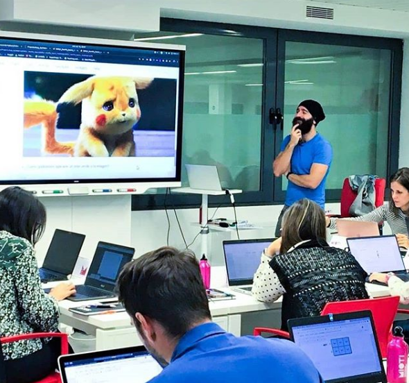

## Me

¡Holi! Soy Mario López, doctor teleco de formación pero ingeniero software de convicción. Llevo unos 8 años creando software: primero aplicando reinforcement learning en investigación de uso eficiente del espacio radioeléctrico, luego integrando sistemas de telcos, y por último, en distintas startups (ERP, insurtech y data engineering). 

Me gusta crear software por si mismo, pero, no concibo su desarrollo si no es como herramienta para alcanzar algún fin, con lo que creo que lo que mejor me define es [ingeniero de producto](https://www.forbes.com/sites/quora/2017/09/06/how-is-a-product-engineer-different-from-a-full-stack-engineer/#3680e33626e7). Un poco por mi carácter controlador (que aplico en mi vida personal también, por ejemplo, teniendo timesheets de mi vida diaria), y un poco como legado de haberme doctorado, suelo acabar desempeñando roles de **gestión de equipo y product**, aunque manteniéndome cercano al código.

Hoy **soy el responsable técnico de la startup de foodtech Bistrohub**, donde ponemkos mucho más fácil a los restaurantes el administrar múltiples plataformas de delivery, sustituyendo un proceso manual error-prone de gestión de pedidos y menús, por una automatización fluida y realizada desde un único lugar. Y añadiendo, además, insights en cuanto a las ventas en las delivery platforms.

*Mis clases son siempre... peculiares* 

También me flipa la enseñanza técnica: pienso que la barrera para ganar skills valiosísimas está muy baja y resulta muy gratificante empoderar personas con estas skills. **Llevo unos 4 años de profe**. primero en la UPCT, en los últimos años en MIOTI, con la asignatura "Data Science with Python". 

Al mismo tiempo, me encuentro en una situación peculiar: soy profe en MIOTI, pero **alumno en el Instituto Tramontana: cursando el programa ejecutivo de dirección de producto**.

## The blog

Este blog para mi es el derecho y la obligación de parar por unos momentos de ingestar información y procesarla, hacer algo con ella, aunque sea sintetizarla, y a poder ser, añadirle mi voz.

¿Qué cabe esperar de temas? No lo sé. Con mucha probabilidad, soft y hard topics de llevar equipos de ingeniería, data y producto. Aunque peco bastante de micro-obsesiones temporales.